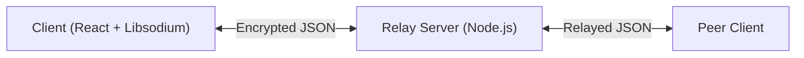

# End-to-End Encrypted (E2EE) Chat Application


A secure, privacy-first messaging platform built with **Next.js** and **Libsodium**. This application implements a "Zero-Knowledge" server architecture where the backend acts solely as a blind relay, ensuring that message content remains accessible only to the intended recipients.

## 🌟 Key Features

-   **End-to-End Encryption**: All messages are encrypted on the client device using XChaCha20-Poly1305 before transmission.
-   **Zero-Knowledge Server**: The relay server sees only encrypted blobs and routing metadata. It cannot read your messages.
-   **Local Identity Vault**: Keys are generated locally and stored in the browser, encrypted by your personal passphrase.
-   **Group Messaging**: Efficient, scalable encrypted group chats using a Signal-style Sender Key protocol.
-   **Secure Handshake**: X25519 ECDH key exchange for establishing shared secrets.
-   **No Database**: The relay server is ephemeral; messages are not stored persistently on the backend.

## 🛠️ Technology Stack

-   **Frontend**: [Next.js 15](https://nextjs.org/), [React 19](https://react.dev/), [Tailwind CSS v4](https://tailwindcss.com/)
-   **Cryptography**: [libsodium-wrappers-sumo](https://github.com/jedisct1/libsodium.js) (WebAssembly)
-   **Real-time**: WebSocket (Native `ws` library)
-   **UI Components**: [Lucide React](https://lucide.dev/), [Sonner](https://sonner.emilkowal.ski/)

## 🚀 Getting Started

### Prerequisites

-   Node.js 18+ installed.
-   npm or yarn or pnpm.

### Installation

1.  **Clone the repository:**
    ```bash
    git clone https://github.com/yourusername/e2ee-chat-clean.git
    cd e2ee-chat-clean
    ```

2.  **Install dependencies:**
    ```bash
    npm install
    ```

3.  **Start the Relay Server:**
    The application requires a local WebSocket relay server to route messages.
    ```bash
    node relay-server.js
    ```
    *The server runs on port `4000` by default.*

4.  **Start the Frontend:**
    In a separate terminal window:
    ```bash
    npm run dev
    ```

5.  **Open the App:**
    Visit `http://localhost:3000` in your browser.

## 📖 Documentation

For a deep dive into the cryptographic protocols, architecture diagrams, and threat model, please refer to the **[Technical Report](./TECHNICAL_REPORT.md)** included in this repository.

### Quick Architecture Overview


## ⚠️ Security Disclaimer

This software is a **Proof of Concept (PoC)** for educational and demonstration purposes. While it uses industry-standard cryptographic primitives (Libsodium), it has not undergone a formal security audit.

**Use at your own risk.** Do not use for mission-critical or life-safety communications without further validation.

## 📄 License

This project is licensed under the MIT License - see the [LICENSE](LICENSE) file for details.
