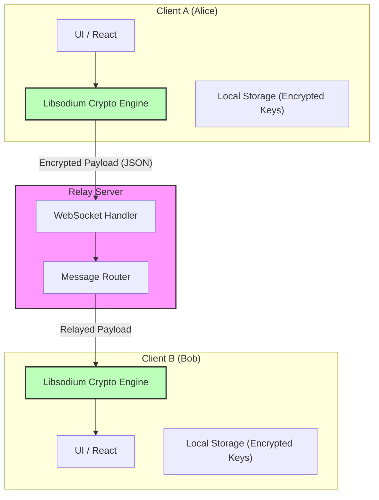
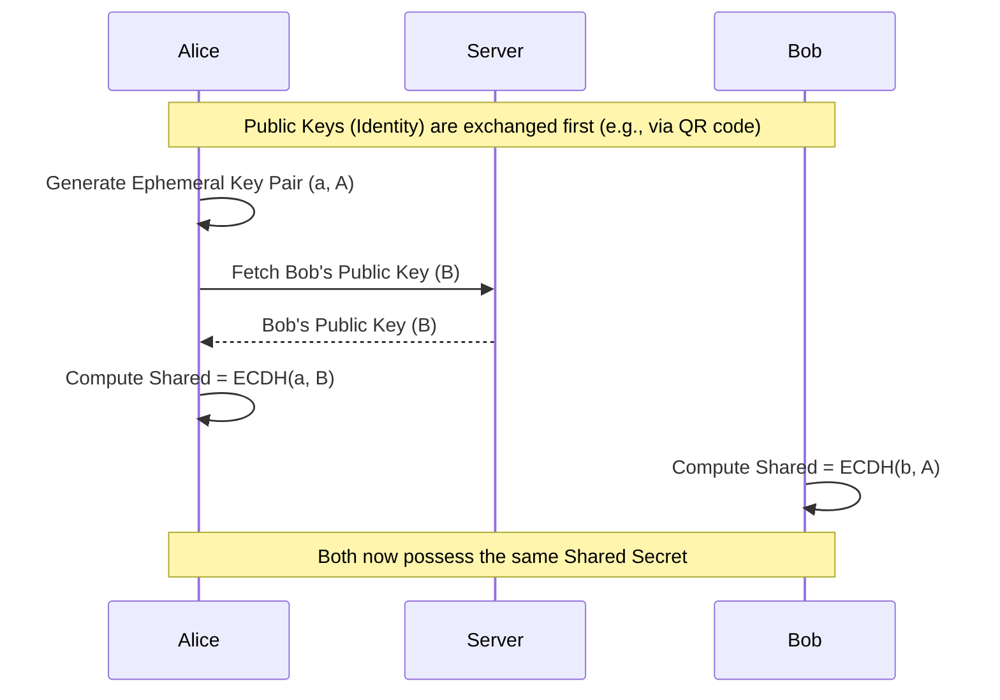
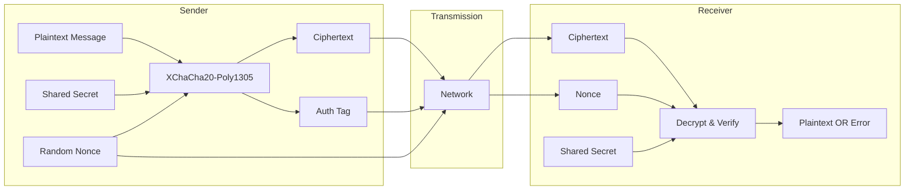
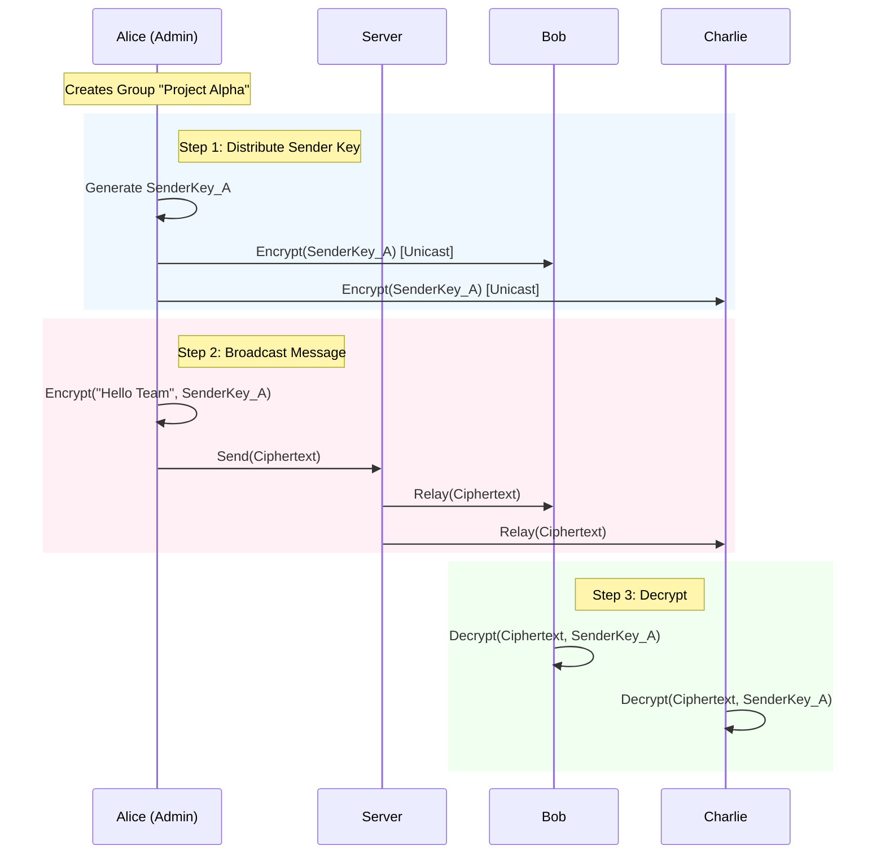
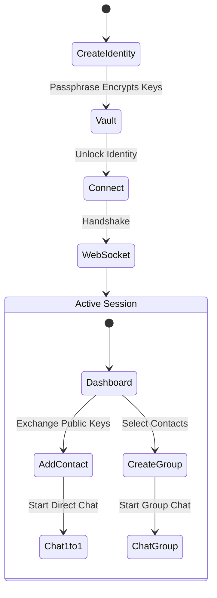

# Technical Report: E2EE Chat Application

## 1. Abstract
This report documents the design and implementation of a secure, end-to-end encrypted (E2EE) messaging system. The application is built using **Next.js** for the frontend and **Libsodium** for high-level cryptographic primitives. The core architectural principle is a "Zero-Knowledge" server model, where the relay server handles only encrypted payloads and routing metadata, ensuring that message content remains accessible only to the intended recipients. Key features include 1:1 messaging with ephemeral key exchanges, efficient group messaging using Sender Keys, and a local-first identity vault.

## 2. Introduction
### 2.1 Problem Statement
Centralized messaging platforms often retain access to user data, creating risks of mass surveillance and data breaches. Even when encryption is used, metadata leakage and server-side key management can compromise user privacy.

### 2.2 Objective
The objective was to develop a "trust-no-one" client-side application where:
1.  **Identities** are generated and stored locally, encrypted by a user passphrase.
2.  **Messages** are encrypted on the device before transmission.
3.  **The Server** acts solely as a blind relay, unaware of the message content.

### 2.3 Scope
The current implementation covers:
-   **Identity Management**: Local creation and encryption of Ed25519/Curve25519 key pairs.
-   **Direct Messaging (1:1)**: Secure communication between two peers.
-   **Group Messaging**: Scalable encrypted communication for multiple participants.

## 3. System Architecture
### 3.1 High-Level Overview
The system follows a "Smart Client, Dumb Server" architecture. The complexity of cryptographic operations, key management, and state handling resides entirely within the client (browser). The backend is a lightweight WebSocket relay.

**Technology Stack:**
-   **Frontend**: Next.js 15, React 19, Tailwind CSS.
-   **Cryptography**: `libsodium-wrappers-sumo` (WebAssembly).
-   **Backend**: Node.js WebSocket Relay (ephemeral, no database).

### 3.2 Architecture Diagram
The following diagram illustrates the separation of concerns between the clients and the relay server.

## 4. Cryptographic Protocol
### 4.1 Primitives
The application relies on modern, high-speed cryptographic primitives provided by Libsodium:
-   **Key Exchange**: X25519 (Elliptic Curve Diffie-Hellman) for deriving shared secrets.
-   **Encryption**: XChaCha20-Poly1305 for authenticated encryption with extended nonces (reducing collision risks).
-   **Hashing**: SHA-256 for generating public key fingerprints (Safety Codes).

### 4.2 Key Exchange / Handshake (1:1)
For direct messaging, peers perform an ECDH handshake to establish a shared secret.

### 4.3 Encryption/Decryption Process
All messages are encrypted using the derived shared secret.

## 5. Message Flow & Features
### 5.1 Group Messaging (Sender Keys)
To avoid the inefficiency of encrypting every group message $N$ times (for $N$ members), we implemented a variant of the **Sender Key** protocol used by Signal.

1.  **Sender Key Generation**: Each member generates a symmetric "Sender Key" (Chain Key + Signature Key).
2.  **Distribution**: This key is encrypted individually (unicast) for every other member using the 1:1 protocol.
3.  **Broadcasting**: Once distributed, the sender encrypts messages using their Sender Key. The server relays this single ciphertext to all members.
4.  **Decryption**: Recipients use the stored Sender Key for that member to decrypt the message.

### 5.2 Group Message Flow Diagram

## 6. User Experience & Flow
The user journey emphasizes security at every step, from identity creation to active communication.

## 7. Threat Model
We assume an "Honest-but-Curious" server and a potentially hostile network environment.

### 7.1 Threat Analysis Diagram

```mermaid
block-beta
    columns 3
    
    block:Attacker1
        A1_Icon[("Network Listener")]
        A1_Desc["Sees TLS Traffic"]
        A1_Result["Safe (HTTPS/WSS)"]
    end

    block:Attacker2
        A2_Icon[("Server Admin")]
        A2_Desc["Has DB Access"]
        A2_Result["Safe (Only Ciphertext)"]
    end

    block:Attacker3
        A3_Icon[("Physical Thief")]
        A3_Desc["Steals Device"]
        A3_Result["Safe (Encrypted Vault)"]
    end
    
    style A1_Result fill:#9f9,stroke:#333
    style A2_Result fill:#9f9,stroke:#333
    style A3_Result fill:#9f9,stroke:#333
```

### 7.2 Mitigations
-   **MITM Attacks**: Mitigated by "Safety Numbers" (Public Key Fingerprints) which users can manually verify out-of-band.
-   **Database Leaks**: The server stores no persistent message history. Even if it did, it would only be encrypted blobs.
-   **Device Compromise**: Local storage is encrypted with a user-derived passphrase.

## 8. Conclusion
This project successfully demonstrates a secure, privacy-first messaging architecture. By leveraging client-side cryptography and a minimal relay server, we eliminate the need to trust a central authority with message content. Future improvements could include offline message queuing and the full Double Ratchet algorithm for forward secrecy.
