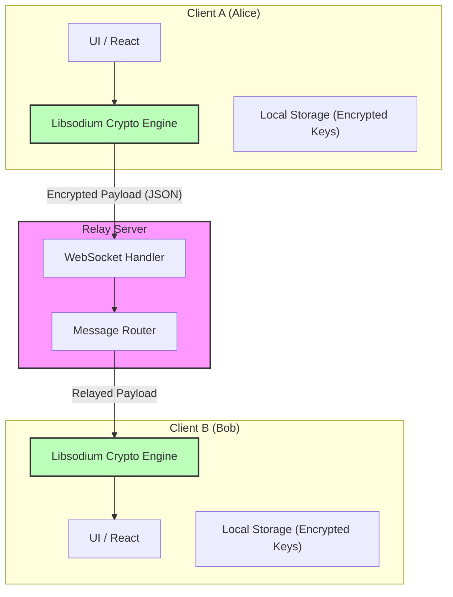
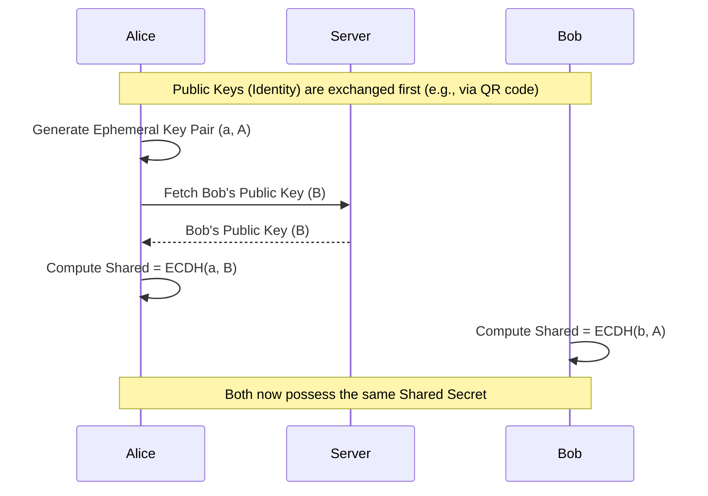
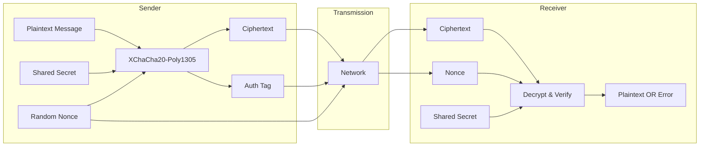
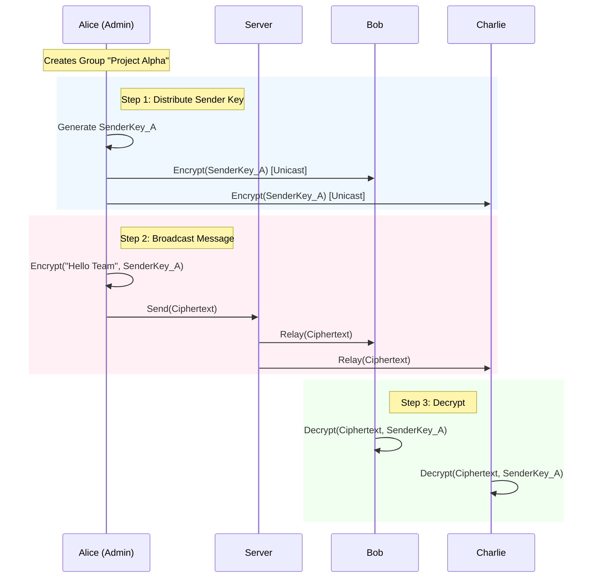
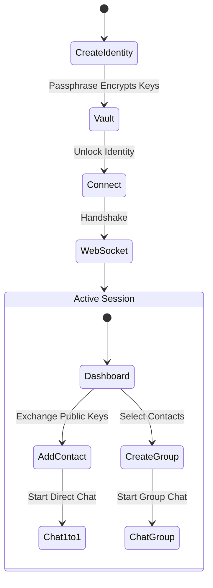
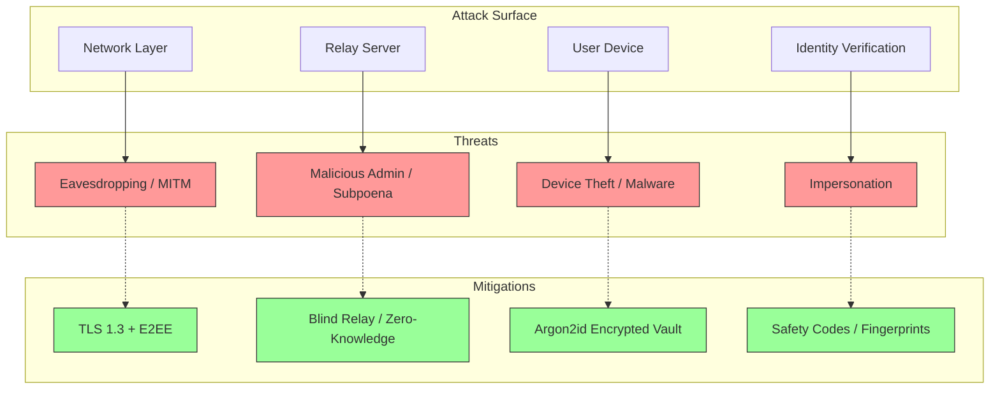

# Technical Report: E2EE Chat Application

## 1. Abstract
This report documents the design and implementation of a secure, end-to-end encrypted (E2EE) messaging system. The application is built using **Next.js** for the frontend and **Libsodium** for high-level cryptographic primitives. The core architectural principle is a "Zero-Knowledge" server model, where the relay server handles only encrypted payloads and routing metadata, ensuring that message content remains accessible only to the intended recipients. Key features include 1:1 messaging with ephemeral key exchanges, efficient group messaging using Sender Keys, and a local-first identity vault.

## 2. Introduction
### 2.1 Problem Statement
Centralized messaging platforms often retain access to user data, creating risks of mass surveillance and data breaches. Even when encryption is used, metadata leakage and server-side key management can compromise user privacy.

### 2.2 Objective
The objective was to develop a "trust-no-one" client-side application where:
1.  **Identities** are generated and stored locally, encrypted by a user passphrase.
2.  **Messages** are encrypted on the device before transmission.
3.  **The Server** acts solely as a blind relay, unaware of the message content.

### 2.3 Scope
The current implementation covers:
-   **Identity Management**: Local creation and encryption of Ed25519/Curve25519 key pairs.
-   **Direct Messaging (1:1)**: Secure communication between two peers.
-   **Group Messaging**: Scalable encrypted communication for multiple participants.

## 3. System Architecture
### 3.1 High-Level Overview
The system follows a "Smart Client, Dumb Server" architecture. The complexity of cryptographic operations, key management, and state handling resides entirely within the client (browser). The backend is a lightweight WebSocket relay.

**Technology Stack:**
-   **Frontend**: Next.js 15, React 19, Tailwind CSS.
-   **Cryptography**: `libsodium-wrappers-sumo` (WebAssembly).
-   **Backend**: Node.js WebSocket Relay (ephemeral, no database).

### 3.2 Architecture Diagram
The following diagram illustrates the separation of concerns between the clients and the relay server.

### 3.3 Architectural Style Classification
Based on standard software architecture classifications, the project implements a hybrid approach:

#### 1. Distributed Architecture Style: **Broker Pattern**
The system falls under the **Distributed** category rather than **Data-Centric**.
*   **Why not Data-Centric?** In a Data-Centric style (e.g., Blackboard or Shared Database), the central data store is the primary integration point and source of truth. Here, the server is transient and stateless; it does not hold the "truth."
*   **The Broker Pattern**: The Relay Server acts as a **Message Broker**. It decouples the sender and receiver. Clients do not connect directly (as in pure P2P) but communicate via a central intermediary that manages the distribution of messages without modifying them.

#### 2. Structural Architecture Style: **Layered Architecture**
Internally, the "Thick Client" follows a strict **Layered** structural style to manage complexity:
*   **Presentation Layer**: React Components (UI).
*   **Application Layer**: State management and event handling logic.
*   **Security Layer**: The Libsodium wrapper (The "Trust Boundary").
*   **Persistence Layer**: Encrypted LocalStorage/IndexedDB.

#### 3. Topology: **Client-Server**
Physically, the nodes are arranged in a star topology (Client-Server), providing the reliability of centralized infrastructure with the privacy properties of a P2P system.

## 4. Cryptographic Protocol
### 4.1 Primitives
The application relies on modern, high-speed cryptographic primitives provided by Libsodium:
-   **Key Exchange**: X25519 (Elliptic Curve Diffie-Hellman) for deriving shared secrets.
-   **Encryption**: XChaCha20-Poly1305 for authenticated encryption with extended nonces (reducing collision risks).
-   **Hashing**: SHA-256 for generating public key fingerprints (Safety Codes).

### 4.2 Key Exchange / Handshake (1:1)
For direct messaging, peers perform an ECDH handshake to establish a shared secret.

**Mathematical Definition:**
Let $G$ be the base point on the Curve25519 elliptic curve.
1.  **Alice** generates a private key $a$ and public key $A = a \cdot G$.
2.  **Bob** generates a private key $b$ and public key $B = b \cdot G$.
3.  **Alice** computes the shared secret $S_A = a \cdot B = a \cdot (b \cdot G)$.
4.  **Bob** computes the shared secret $S_B = b \cdot A = b \cdot (a \cdot G)$.
5.  Since scalar multiplication is commutative, $S_A = S_B = S$.

> **Example Scenario:**
> 1.  **Alice** generates ephemeral pair: `priv_a = 0x11...`, `pub_A = 0xAA...`
> 2.  **Bob** has identity key: `priv_b = 0x22...`, `pub_B = 0xBB...`
> 3.  **Alice** calculates `Shared_S = ECDH(priv_a, pub_B)`.
> 4.  **Bob** receives `pub_A` and calculates `Shared_S = ECDH(priv_b, pub_A)`.
> 5.  Both result in the same secret `0x99...` without ever transmitting it.

### 4.3 Encryption/Decryption Process
All messages are encrypted using the derived shared secret.

**Mathematical Definition:**
Encryption uses the **XChaCha20-Poly1305** construction.
*   Let $K$ be the 32-byte Shared Secret.
*   Let $N$ be a random 24-byte Extended Nonce.
*   Let $P$ be the Plaintext message.
*   The encryption function $E$ produces a pair $(C, T)$:
    $$ (C, T) = \text{XChaCha20-Poly1305}(K, N, P) $$
    Where $C$ is the Ciphertext and $T$ is the 16-byte Authentication Tag.

> **Example Scenario:**
> *   **Input**: "Meet at 5 PM"
> *   **Shared Secret**: `0xFE...` (Derived from handshake)
> *   **Nonce**: `0x01...` (Unique per message)
> *   **Process**: `XChaCha20Poly1305_Encrypt("Meet at 5 PM", Key, Nonce)`
> *   **Output**: `Ciphertext = 0x82...`, `MAC = 0x33...`
> *   **Result**: The server sees only `0x82...` and `0x33...`. It cannot decrypt the text "Meet at 5 PM".

## 5. Message Flow & Features
### 5.1 Group Messaging (Sender Keys)
To avoid the inefficiency of encrypting every group message $N$ times (for $N$ members), we implemented a variant of the **Sender Key** protocol used by Signal.

1.  **Sender Key Generation**: Each member generates a symmetric "Sender Key" (Chain Key + Signature Key).
2.  **Distribution**: This key is encrypted individually (unicast) for every other member using the 1:1 protocol.
3.  **Broadcasting**: Once distributed, the sender encrypts messages using their Sender Key. The server relays this single ciphertext to all members.
4.  **Decryption**: Recipients use the stored Sender Key for that member to decrypt the message.

**Mathematical Definition (The Ratchet):**
The Sender Key advances using a Hash-Based Key Derivation Function (HKDF), specifically `HMAC-SHA256`.
*   Let $CK_i$ be the current **Chain Key**.
*   **Message Key Derivation**: $MK_i = \text{HMAC-SHA256}(CK_i, \text{0x01})$.
*   **Next Chain Key**: $CK_{i+1} = \text{HMAC-SHA256}(CK_i, \text{0x02})$.
*   The message is encrypted using $MK_i$. The Chain Key $CK_i$ is then destroyed and replaced by $CK_{i+1}$, ensuring forward secrecy for future messages relative to the current state.

> **Example Scenario:**
> *   **Alice** creates a random 32-byte **Chain Key** and a **Signature Key**.
> *   She encrypts this bundle *once* for Bob (using their 1:1 shared secret) and *once* for Charlie.
> *   Bob and Charlie now have "Alice's Group Key".
> *   When Alice sends a message, she derives a **Message Key** from her Chain Key, encrypts the message, and increments the chain.

### 5.2 Group Message Flow Diagram

> **Example Walkthrough:**
> 1.  **Alice** types "Hello Team".
> 2.  Her client grabs `SenderKey_A` from storage.
> 3.  It encrypts "Hello Team" -> `Ciphertext_1`.
> 4.  Client sends `Ciphertext_1` to Server with `groupId="Project Alpha"`.
> 5.  **Server** looks up members of "Project Alpha" (Bob, Charlie).
> 6.  **Server** forwards `Ciphertext_1` to Bob and Charlie.
> 7.  **Bob** receives it, sees it's from Alice, looks up `SenderKey_A`, and decrypts it.

## 6. User Experience & Flow
The user journey emphasizes security at every step, from identity creation to active communication.

## 7. Threat Model
We assume an "Honest-but-Curious" server and a potentially hostile network environment. The following diagram details the specific attack vectors and the corresponding mitigations.

### 7.1 Threat Analysis Diagram

### 7.2 Detailed Mitigations
1.  **Network Snooping**:
    *   **Risk**: An attacker on the same Wi-Fi or ISP captures packets.
    *   **Defense**: All traffic is wrapped in **TLS 1.3** (HTTPS/WSS). Even if TLS is broken, the payload is **End-to-End Encrypted** (XChaCha20), meaning the attacker sees only random noise.

2.  **Server Compromise**:
    *   **Risk**: The server administrator logs all messages or is forced to hand over data.
    *   **Defense**: The server is a **Blind Relay**. It possesses no private keys and cannot decrypt any messages. It stores no persistent message history (ephemeral RAM only).

3.  **Device Compromise**:
    *   **Risk**: A thief steals the physical device or malware accesses the local storage.
    *   **Defense**: The Identity Vault (containing private keys) is encrypted using **XSalsa20-Poly1305**. The key for this vault is derived from the user's passphrase using **Argon2id** (a memory-hard function resistant to GPU cracking).

4.  **Identity Spoofing (MITM)**:
    *   **Risk**: An attacker intercepts the initial handshake and swaps public keys (Man-in-the-Middle).
    *   **Defense**: Users can verify **Safety Codes** (SHA-256 fingerprints of public keys) out-of-band (e.g., in person or via another channel) to ensure they are communicating with the correct party.

## 8. Performance Analysis
-   **Client-Side Overhead**: Utilizing WebAssembly (WASM) for Libsodium provides near-native performance for cryptographic operations, significantly faster than pure JavaScript implementations.
-   **Group Scalability**: The Sender Key protocol reduces the complexity of sending a group message from $O(N^2)$ (pairwise encryption) to $O(N)$ (one encryption, N decryptions). This allows the system to scale efficiently to large groups without burdening the sender's device.

## 9. Security Trade-offs & Limitations
-   **Metadata Leakage**: While message content is protected, the relay server can observe traffic patterns (who is messaging whom, message size, and timing). This is a known trade-off in systems that do not employ onion routing (like Tor).
-   **Forward Secrecy**: The current implementation uses long-term identity keys for simplicity. If an identity key is compromised, past messages could potentially be decrypted. A full implementation of the Double Ratchet Algorithm would provide forward secrecy.
-   **No Offline Queuing**: Messages are ephemeral and delivered only if the recipient is online. This reduces server storage risks but impacts usability.

## 10. Implementation Highlights
-   **Directory Structure**:
    -   `src/lib/crypto`: Core cryptographic wrappers (encryption, signing, hashing).
    -   `src/lib/identities`: Local vault management and key storage.
    -   `src/lib/groups`: Sender Key state management and group logic.
-   **State Management**: React hooks (`useEffect`) are optimized to handle asynchronous WASM initialization and key derivation without blocking the UI thread.

## 11. Future Roadmap
-   **Offline Inbox**: Implementing an encrypted store-and-forward mechanism on the server to hold messages for offline users.
-   **File Sharing**: Encrypting large files with ephemeral symmetric keys and transmitting the key via the secure channel, while hosting the encrypted blob on a separate storage service.
-   **Multi-Device Support**: Synchronizing the identity vault across devices using a secure pairing protocol.

## 12. Conclusion
This project successfully demonstrates a secure, privacy-first messaging architecture. By leveraging client-side cryptography and a minimal relay server, we eliminate the need to trust a central authority with message content. Future improvements could include offline message queuing and the full Double Ratchet algorithm for forward secrecy.

<!--  -->